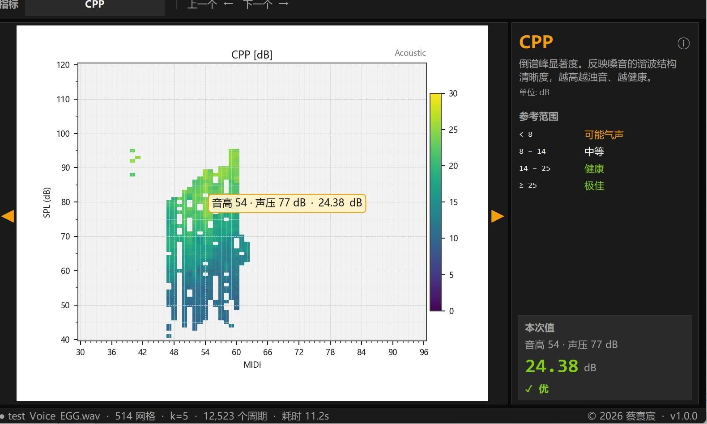
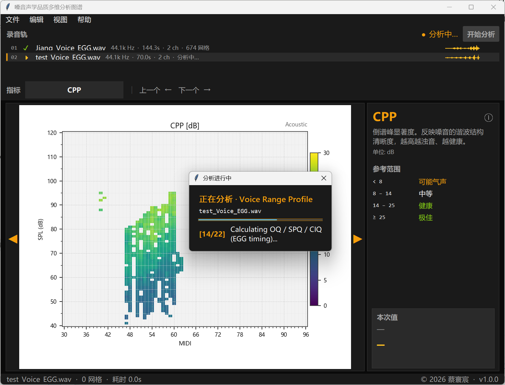
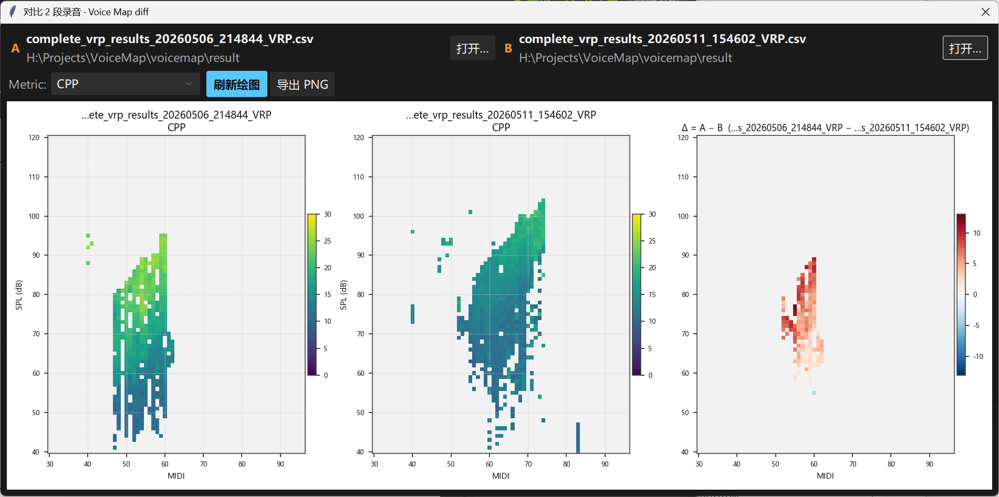
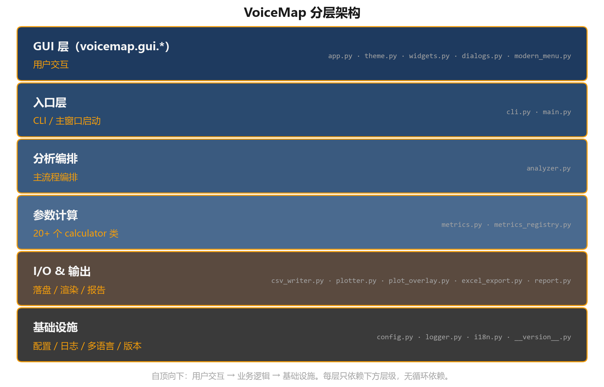

# VoiceMap · 嗓音声学品质多维分析图谱

[](https://github.com/HuanchenCai/VoiceMapping/actions/workflows/validate.yml)

**Version** 1.0.0 · **License** MIT · **Platform** Windows 10/11 x64 (GUI) · CLI runs anywhere Python 3.10+ does

Voice Range Profile (VRP) analyzer for clinical voice screening, singing
research and pedagogy. Stereo WAV in → 40+ voice-quality metrics aggregated
onto the (MIDI pitch × SPL) grid, rendered as interactive heatmaps, exported
to CSV / Excel / Markdown clinical report / PDF figures.

All algorithms re-implement published references (MDVP / KayPENTAX, Praat,
McLeod-Wyvill NSDF, Hillenbrand CPP, and a SuperCollider VRP toolkit for the
EGG metrics; attribution in [`LICENSE`](LICENSE)). Every cell in the output
table is a `(pitch, loudness)` bin; each column is one voice-science
descriptor computed per glottal cycle and aggregated over the cell.

<p align="center">
  
</p>

## Quick start

```bash
pip install -r requirements.txt
python main.py audio/test_Voice_EGG.wav          # CLI: CSV + per-metric heatmaps in result/
python main.py --gui                              # GUI: drop a .wav, see the voice map live
```

The bundled sample `audio/test_Voice_EGG.wav` (70 s, 44.1 kHz, channel 1 =
microphone, channel 2 = EGG) runs in about 11 s and yields 514 populated
cells from 12,523 glottal cycles with the default clarity threshold 0.96.
Windows users can double-click `启动.bat` instead of the second command.

More CLI patterns:

```bash
python main.py --batch corpus/ --plot-mode none                 # batch a directory, CSV only
python main.py audio.wav --clarity 0.97 --cluster-k 6 --plot-mode combined
python main.py audio.wav --excel --report                       # also .xlsx workbook + Markdown clinical report
python main.py --train-centroids cEGG.csv wav1.wav wav2.wav     # cross-subject cluster parity
python main.py new_subject.wav --load-centroids cEGG.csv
python main.py --compare a_VRP.csv b_VRP.csv --compare-metric CPP --compare-out diff.png
```

Full flag list: `python main.py --help`.

## Screenshots

| Analysis running, metric sidebar with clinical reference ranges | Compare two recordings: A, B and A − B |
|---|---|
|  |  |

More in [`docs/screenshots/`](docs/screenshots): main window, annotations,
pitch-trend fit overlay, log panel.

## Example results and validation

- **Bundled real fixture**: `python tests/validate_params.py audio/test_Voice_EGG.wav`
  compares every metric against Praat (parselmouth) and prints
  `PASS=49  WARN=0  FAIL=0` on the current baseline. Run it after any metric
  change.
- **Per-metric evidence**: each metric has a validation record under
  [`docs/validation/metrics/`](docs/validation/metrics) (implementation,
  reference standard, test signals, results, limitations). The harness is
  `python scripts/validate_metric.py <metric>` and gates on exit code.
- **Synthetic ground truth**: `python docs/validation/test_signals/make_signals.py`
  regenerates 12 WAVs with analytically known jitter, shimmer, vibrato,
  band ratios and EGG closed quotient ([details](docs/validation/test_signals/README.md)).
- **End-to-end regression**: `python scripts/e2e_regression.py` checks three
  analysis modes against the committed `docs/validation/regression/e2e_baseline.json`.
- **CI**: the `validate` workflow runs the signal regeneration, the harness and
  the Praat-parity unit tests on Python 3.11 and 3.12 on every push.

[`docs/reproducibility.md`](docs/reproducibility.md) lists every one-command
reproduction with its expected output; [`docs/methodology.md`](docs/methodology.md)
gives the formula and literature source for each metric.

## Machine-learning use

`voicemap.ml.VoiceFeatureExtractor` turns a recording into a fixed-length
feature vector that drops straight into a scikit-learn `Pipeline`;
[`docs/ml_schema.md`](docs/ml_schema.md) is the column contract.
[`examples/ml_demo.py`](examples/ml_demo.py) is a self-contained end-to-end
demo (voice → features → classifier) on a synthetic three-class corpus
(modal / breathy / rough):

```bash
python examples/ml_demo.py          # 8 samples per class
python examples/ml_demo.py 12
```

## Input

Stereo WAV. **Channel 1 = voice microphone, channel 2 = EGG**
(electroglottograph). Sample rate is auto-detected; 44.1 kHz / 48 kHz
are the common values in the test corpora. Mono (acoustic-only) files are
accepted; EGG columns are then written as 0.

## Pipeline

1. **Load** stereo WAV → voice + EGG via soundfile.
2. **Preprocess**
   - Voice: 2nd-order Butterworth HPF @ 30 Hz (`scipy.signal.filtfilt`)
   - EGG:   FIR bandpass + PV-compander expander
3. **Cycle detection** — phase-portrait method on the EGG channel
   (Dolansky algorithm; numba JIT when available).
4. **Per-cycle metrics** — see schema below.
5. **Clarity filter** — cycles with clarity < `config.clarity_threshold`
   are dropped (default 0.96; GUI exposes this as a slider that also
   acts as a display filter after analysis).
6. **Grid aggregation** — round MIDI and SPL to integers, group by
   (MIDI, dB) cell, apply per-metric aggregator (see table).
7. **Output** — semicolon-CSV to `result/`, optional PNG plots, optional
   .xlsx workbook and Markdown report.

## Metric schema

The CSV columns, grouped by what they measure. The GUI's Metric dropdown
uses the same groups; `voicemap/metrics_registry.py` is the single source
of truth and `docs/ml_schema.md` the generated full list.

### Identification / density

| Column | Units | Description |
|---|---|---|
| MIDI | integer | Voice pitch bin (30–96 ≈ F#1–C8) |
| dB | integer | SPL bin (40–120 dB) |
| Total | cycles | Number of cycles mapped into this cell (sum aggregator) |

### Acoustic (voice mic)

All agg = `mean`. Clarity uses `max`.

| Column | Units | Typical / Normal | Description |
|---|---|---|---|
| Clarity | — | ≥ 0.96 kept | McLeod-Wyvill NSDF pitch-detection confidence |
| CPP | dB | 8–25 dB healthy | Cepstral Peak Prominence (1024-pt real cepstrum) |
| SpecBal | dB | − 30 to 0 | Spectral balance: 10·log(E_below_1500Hz / E_above) |
| Crest | — | 1.4–4 | Peak-to-RMS amplitude ratio |
| Entropy | — | < 5 modal | Sample Entropy (CSE) over per-cycle DFT amps + phases |
| Jitter | % | < 1.04% | MDVP local jitter with 1.3× period-factor rejection |
| JitterRAP | % | < 0.68% | 3-point relative average perturbation |
| JitterPPQ5 | % | < 0.84% | 5-point pitch perturbation quotient |
| Shimmer | % | < 3.8% | MDVP local shimmer with 1.6× amplitude-factor rejection |
| ShimmerDB | dB | < 0.35 dB | dB shimmer: mean \|20·log10(A[i]/A[i-1])\| |
| ShimmerAPQ11 | % | < 1.78% | 11-point amplitude perturbation quotient |
| HNR | dB | > 20 dB healthy | Praat-style autocorrelation HNR with window compensation |

### EGG (electroglottograph channel)

| Column | Units | Typical | Description |
|---|---|---|---|
| Qcontact | — | 0.3–0.6 | Integral-based contact quotient |
| Icontact | — | 0–0.7 | Index of contacting: log(dEGGmax)·Qcontact |
| dEGGmax | slope | 1–20 | Peak amplitude of the EGG derivative (normalized) |
| HRFegg | dB | − 30 to 10 | Harmonic Richness Factor from per-cycle EGG DFT |
| OQ | — | 0.4–0.7 modal | Open Quotient from dEGG peaks (Howard/Baken) |
| SPQ | — | 0.8–1.5 | Speed Quotient: T_opening / T_closing |
| CIQ | — | − 0.3–0.3 | Contact asymmetry: (T_closing − T_opening) / T_open |

### Singing-specific

| Column | Units | Typical | Description |
|---|---|---|---|
| VibratoRate | Hz | 5–7 (Peking opera 5–6) | Dominant modulation freq in 4–8 Hz band |
| VibratoExtent | cents pk-pk | 50–200 | Peak-to-peak F0 modulation amplitude |
| F1 | Hz | 300–1000 | 1st formant (vowel height) from LPC |
| F2 | Hz | 900–2500 | 2nd formant (vowel backness) |
| F3 | Hz | 2200–3500 | 3rd formant (part of singer's formant cluster) |
| SingersFormant | dB | − 7 to − 13 classical | 2.8–3.4 kHz band energy / total (the "ring") |
| H1H2 | dB | 2–6 modal | H1 vs H2 amplitude diff; >10 breathy, ≤0 pressed |
| H1H3 | dB | 5–15 modal | H1 vs H3 amplitude diff (spectral tilt) |

### Clustering

K-means (k=5 default, configurable) on a 3·(n−1)-dim feature vector.
Labels are stable within one run. For cross-subject comparability, train
centroids on a pooled corpus (`--train-centroids`) and load them before
analysing each subject (`--load-centroids`).

| Column | Description |
|---|---|
| maxCluster | Dominant EGG-shape cluster index (1–k) per cell |
| Cluster 1–5 | Percentage of cycles in cluster k |
| maxCPhon | Dominant phonation-type cluster (independent K-means over 9 acoustic metrics) |
| cPhon 1–5 | Percentage of cycles in phonation cluster k |

## Methodology notes

- **Cycle segmentation** is EGG-based (phase-portrait on the EGG
  channel). Praat-style tools segment on voice autocorrelation. This
  difference is visible in Jitter (EGG tends to pick up true glottal
  pulses that voice-autocorr smooths); the EGG version is arguably more
  accurate for voice science.
- **HNR**: per-frame 40 ms Hann window, 10 ms hop, with window-autocorr
  compensation (omitting this compensation underestimates HNR by 10–15 dB).
- **Formants**: LPC via autocorrelation + Levinson-Durbin (order
  `2 + 2·Fs/1000`), spectral peak-picking above an F1 floor of 250 Hz.
  Expect ±10–20% divergence from Praat's Burg + root-finding tracker.
- **Clusters**: the EGG shape K-means operates on a feature vector of
  `[Δamp_dB[1..n-1], cos(Δφ[1..n-1]), sin(Δφ[1..n-1])]` where the
  fundamental is the reference.

## Output files

- `result/complete_vrp_results_YYYYMMDD_HHMMSS_VRP.csv` — the grouped
  VRP table (semicolon delimiter).
- `result/plots/<basename>_<metric>.png` — per-metric heatmaps (CLI
  default; GUI skips by default, opt-in via Settings).
- `result/<basename>.xlsx` — optional Excel workbook with Summary,
  Grouped, and per-metric pivot sheets (`--excel`).
- `result/<csv name>.report.md` — optional clinical narrative next to the CSV (`--report`).
- `<path>.csv` for EGG cluster centroids (`--save-centroids` /
  `--train-centroids`).

## Building the Windows app

```bat
build_exe.bat
```

PyInstaller one-folder build, output `dist\VoiceMap\VoiceMap.exe`.
`installer.iss` wraps that folder into a setup.exe with Inno Setup (Start Menu
and Desktop shortcuts). Both scripts look for Python in `VOICEMAP_PYTHON`,
then the `fonadyn` conda env, then `PATH`.

## Architecture



```
main.py                          CLI / GUI entry shim
voicemap/
├── __version__.py               Single source of truth: title, version, author
├── config.py                    VoiceMapConfig dataclass (SR, grid, SPL
│                                correction, LPC / cluster / entropy knobs)
├── logger.py                    Project-wide logger setup
├── i18n.py                      zh / en string table + tr() helper
├── metrics_registry.py          MetricSpec dataclass + REGISTRY (50+ metrics,
│                                single source of truth for plotter / GUI /
│                                Excel / report / ML schema)
├── metrics.py                   One class per metric family (SPL, Clarity,
│                                CPP, SpecBal, Crest, Qcontact, Entropy,
│                                HRFegg, Cluster, PhonCluster, Perturbation,
│                                HNR, Vibrato, Formant, HarmonicDiff,
│                                OpenQuotient, plus spectral-shape add-ons)
├── analyzer.py                  VoiceMapAnalyzer — pipeline orchestrator
├── csv_writer.py                Semicolon CSV output
├── plotter.py                   matplotlib heatmap renderer
├── plot_overlay.py              Pitch-mean / metric-trend fit overlays
├── excel_export.py              .xlsx writer (Summary + Grouped + pivots)
├── report.py                    Markdown clinical narrative report
├── ml.py                        sklearn VoiceFeatureExtractor + read_vrp()
├── praat_pitch.py / praat_perturbation.py   Praat-parity reference paths
├── inverse_filtering.py / f0_profile.py     Experimental add-ons
├── cli.py                       argparse CLI
└── gui/
    ├── app.py                   tkinter main window (VoiceMapApp)
    ├── theme.py                 Design tokens (colors, fonts, palettes)
    ├── widgets.py               Reusable widgets (HoverTooltip, MetricPopup,
    │                            QueueHandler, focusable-label factory)
    ├── modern_menu.py           Custom dark menubar + popup
    └── dialogs.py               Settings / Compare / About / Log windows

tests/                           Unit tests + validate_params.py (Praat cross-validation)
scripts/                         validate_metric.py, e2e_regression.py, benchmark.py, ...
docs/methodology.md              Per-metric algorithm and literature reference
docs/reproducibility.md          One-command reproductions and expected outputs
docs/api_stability.md            Public API surface and semver promise
docs/ml_schema.md                Generated column contract
docs/validation/                 Plan, per-metric records, synthetic signals, regression baseline
```
