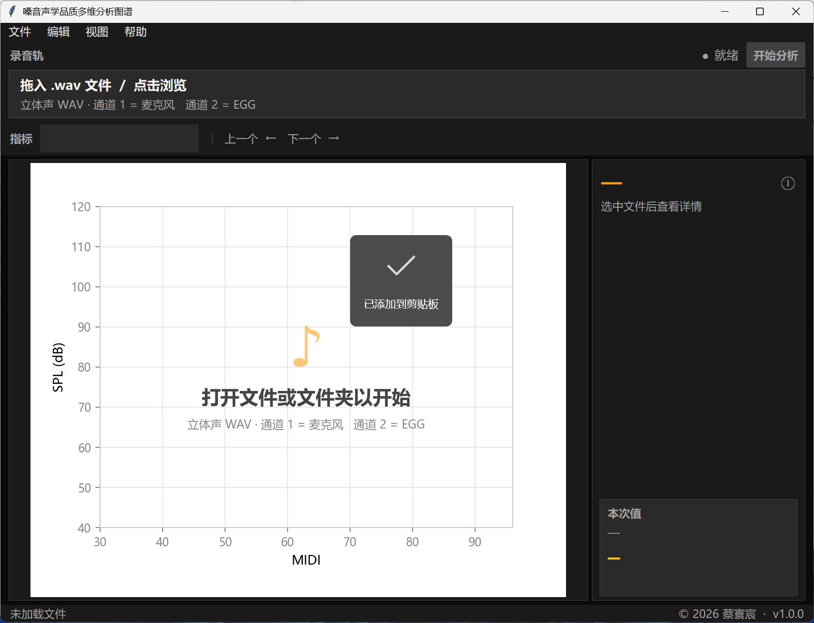
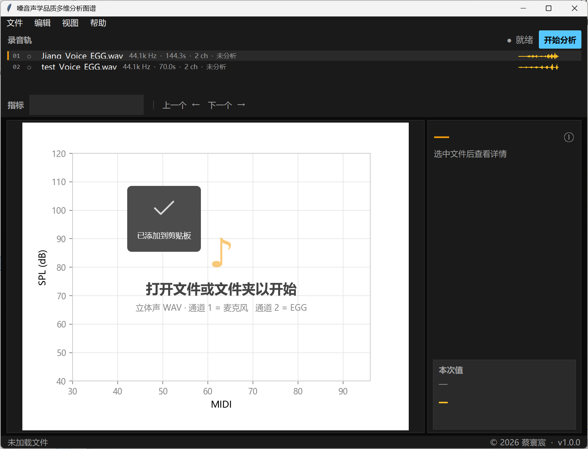
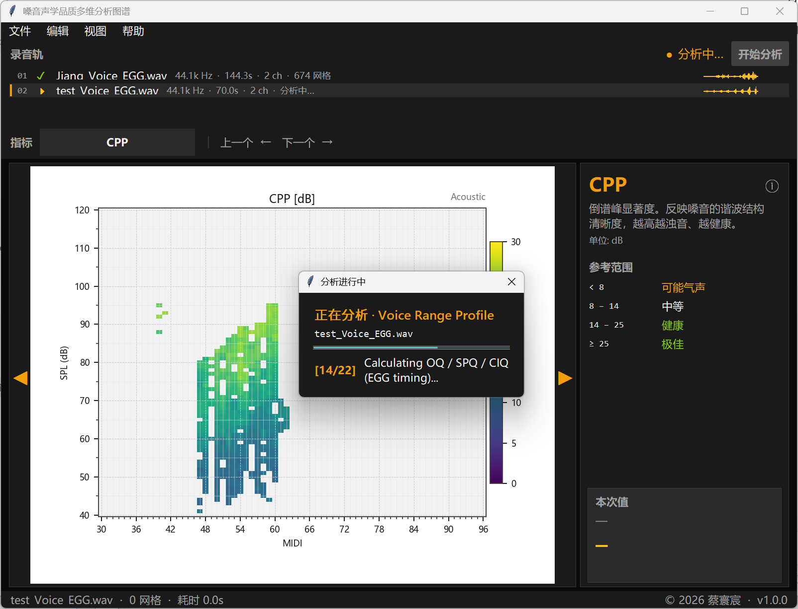
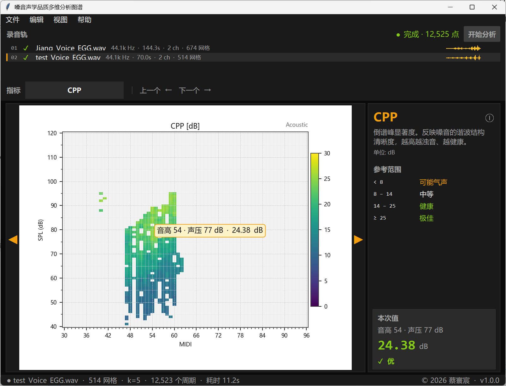
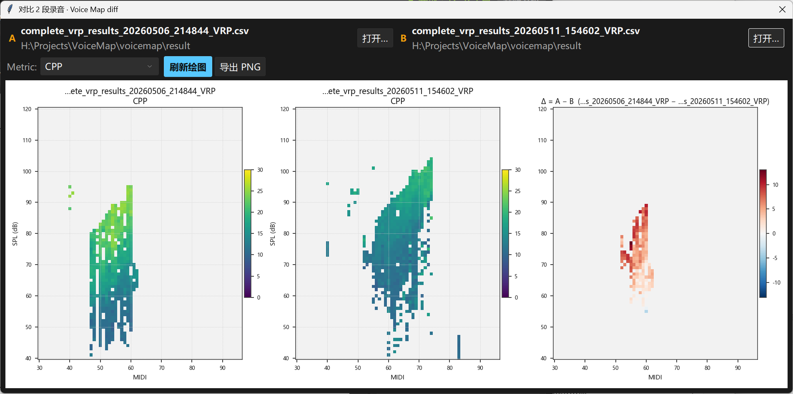
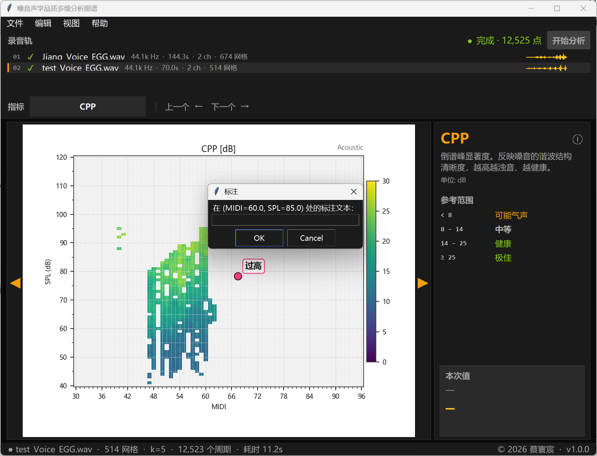
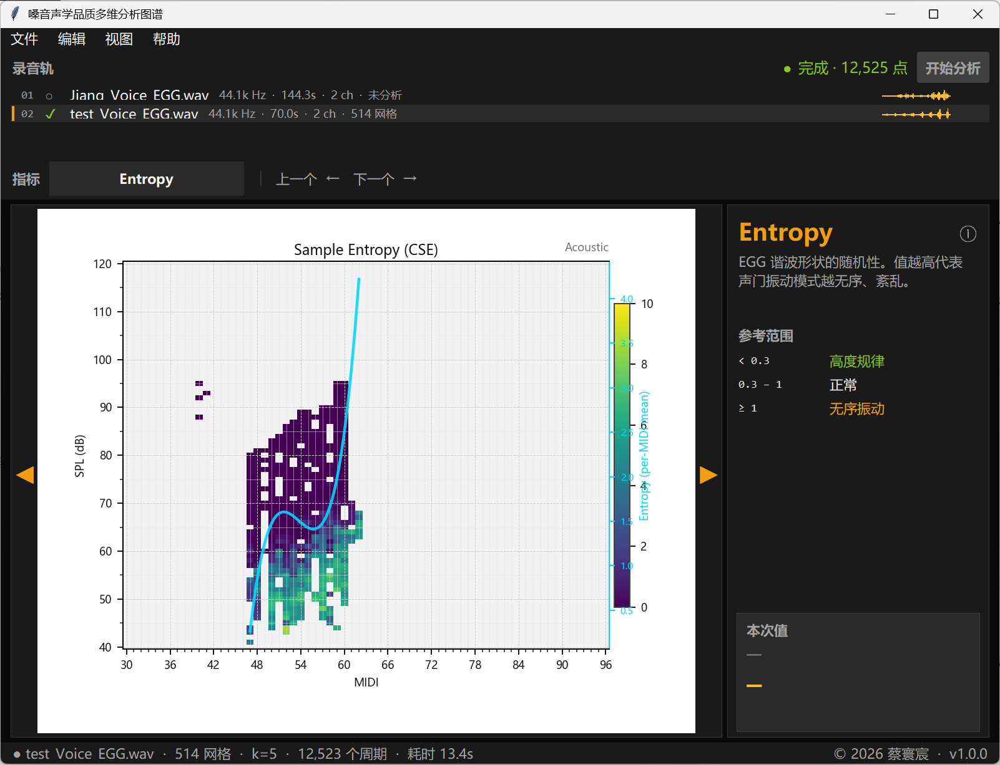
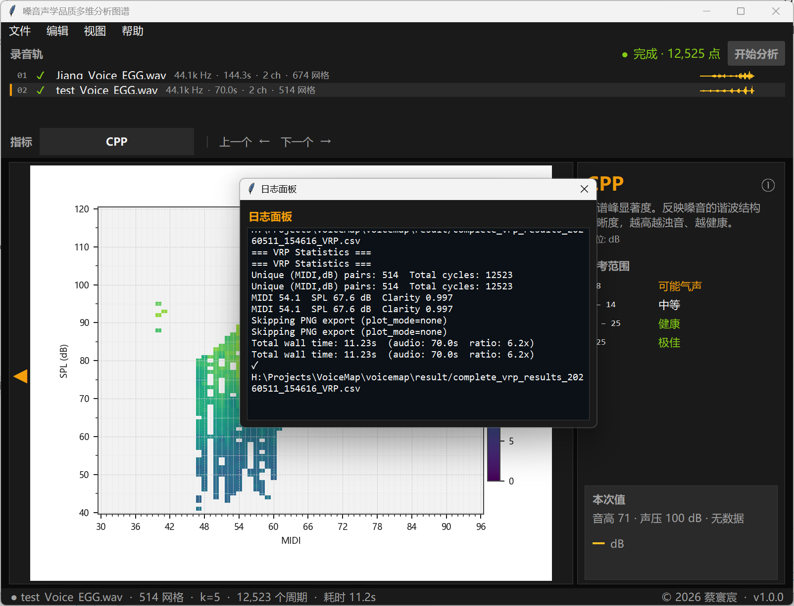

# 嗓音声学品质多维分析图谱 · 用户手册

**软件名**：嗓音声学品质多维分析图谱（VoiceMap）
**版本**：V1.0.0
**作者**：蔡寰宸 (Huanchen Cai)
**邮箱**：huanchen.se@gmail.com
**版权**：Copyright © 2026 蔡寰宸 · MIT 许可

---

## 1. 软件概述

本软件用于嗓音的多维度声学 / 电声门图（EGG）分析。给定双声道 WAV 文件
（通道 1 = 麦克风，通道 2 = EGG），软件对录音逐周期切分，在 (MIDI 音高,
SPL 声压级) 二维网格上聚合 40+ 项嗓音质量参数，生成音域分布图
（Voice Range Profile, VRP）热图，可用于嗓音诊断、歌手训练、声乐教学
和科研。

**主要功能**

- 单文件 / 多文件录音管理（支持原生拖放）
- 40+ 项嗓音质量参数计算（CPP、HNR、Jitter、Shimmer、Qcontact、聚类等）
- VRP 热图实时渲染 + 鼠标悬浮实时显示当前格的参数值
- 临床范围参考（基于 MDVP / 文献阈值）
- 多种格式导出（CSV、Excel 多 sheet、Markdown 报告、PNG / PDF / SVG / EMF 图片）
- 中英文双语切换
- 多 wav 联合 K-means 中心点训练，跨录音保持簇标签一致
- 线性 / 多项式拟合曲线叠加，发掘参数随音高 / 声压的走向

---

## 2. 系统要求

- **操作系统**：Windows 10 / 11（64 位）
- **CPU**：x86_64，2 核以上
- **内存**：≥ 4 GB（分析 60 秒立体声 wav 约用 800 MB）
- **磁盘**：≥ 200 MB（程序 + 缓存）
- **拖放支持**：原生 WAV 拖入窗口（安装包已自带，无需额外配置）

---

## 3. 启动

### 3.1 双击 `启动.bat`

项目根目录有 `启动.bat`，双击即打开图形界面。

### 3.2 命令行

```
python main.py --gui              # 打开图形界面
python main.py audio\test.wav     # 命令行直接分析
python main.py --help             # 查看所有选项
```

### 3.3 安装包

发布版双击 `VoiceMap_v1.0.0_setup.exe` 即可安装，安装完成后
桌面 / 开始菜单生成快捷方式，双击启动。

---

## 4. 主界面



启动后界面分为四个区域：

```
┌────────────────────────────────────────────────────────────┐
│ 文件  编辑  参数  视图  帮助                                  │  ← 菜单栏
├────────────────────────────────────────────────────────────┤
│ 录音轨               ● 就绪    [开始分析]                    │  ← 录音轨
│ ▌01 ✓ test_Voice_EGG.wav  44.1k Hz · 8.2s · 12,525 网格  ▓▓▓│
├────────────────────────────────────────────────────────────┤
│ 参数 [CPP]  │ 上一个 ←  下一个 →                            │  ← 参数轨
├──────────────────────────────────────┬─────────────────────┤
│                                      │ CPP            ⓘ     │
│  ◀  画布（VRP 热图）              ▶  │ 倒谱峰显著度          │
│                                      │ 单位: dB             │
│                                      │                      │
│                                      │ 参考范围              │
│                                      │ ≥14 健康 ✓           │
│                                      │ 8-14 中等             │
│                                      │ <8 低                │
│                                      │                      │
│                                      │ ┌────────────────┐  │
│                                      │ │ 本次值          │  │
│                                      │ │ MIDI 60·SPL 80  │  │
│                                      │ │ 18.50  dB ✓good│  │
│                                      │ └────────────────┘  │
├──────────────────────────────────────┴─────────────────────┤
│ ● test_Voice_EGG.wav · 12,525 网格 · k=5 · 3,420 个周期     │  ← 状态栏
│ · 耗时 12.6 秒                          © 2026 蔡寰宸 v1.0  │
└────────────────────────────────────────────────────────────┘
```

### 4.1 菜单栏

- **文件**：打开 WAV / 打开输出目录 / 导出 Excel / 生成报告 /
  对比 2 段录音 / 设置 / 退出
- **编辑**：标注（点格加注释）/ 重置标注 / 复制图片 / 保存图片
- **参数**：上一个 / 下一个参数 / 5 大参数分类（声学 / EGG / 唱歌特异性 /
  聚类 / 密度）/ 聚类中心（Centroid）子菜单
- **视图**：拟合曲线（音域中心线 / 参数趋势线）/ 日志面板
- **帮助**：关于 / 语言（中文 / English）

### 4.2 录音轨

- 拖入文件，或由菜单 文件 → 打开 WAV 加载录音
- 右侧显示当前状态指示（● 就绪 / 分析中… / 完成 · N 点）和 "开始分析" 按钮
- 加载完文件需点 "开始分析" 按钮才开始分析（不自动触发）
- 多 wav 同时拖入：全部进入列表，按钮分析当前选中的那条
- 点击任意行切换为当前文件（已分析的从内存恢复，未分析的就地分析）
- 行内显示：编号、状态符号（○ 待分析 / ⏵ 分析中 / ✓ 已分析 / ✗ 失败）、
  文件名、采样率、时长、通道数、网格数、迷你波形预览

### 4.3 参数轨

显示当前参数名（如 `CPP`）。切换方式：

1. 顶部菜单：参数 → 分类 → 选择具体参数
2. 键盘 ← / → 上下切换
3. 画布两侧浮动 ◀ ▶ 箭头点击

### 4.4 右侧详情栏

- **顶部**：当前参数名（大字）+ ⓘ 提示图标 + 描述 + 单位
  - 鼠标悬浮标题或 ⓘ 图标，弹出详细公式 / 临床意义
- **中部（可滚动）**：参考范围 —— 4 档严重度色（绿 / 灰 / 橙 / 红），
  按参数自动加载对应文献阈值
- **底部（固定）**：本次值卡 —— 鼠标移到画布任意格，实时显示
  该格的 (MIDI, SPL) 坐标 + 参数值 + 严重度色 + 严重度文字
- 导出 Excel / 生成报告 / 对比录音 等操作走顶部菜单（文件）

### 4.5 状态栏

显示当前文件的元信息：文件名 · 网格数 · k 值 · 周期数 · 耗时。
右侧固定版权 + 版本号。

---

## 5. 操作流程

### 5.1 单文件分析

1. 双击 `启动.bat` 打开图形界面
2. 拖一个双声道 WAV 进入窗口（或菜单 文件 → 打开 WAV）

   

3. 点 "开始分析" 按钮，等待分析（约 12 秒 / 60 秒录音）——
   进度对话框实时显示阶段

   

4. 完成后右侧画布自动渲染当前参数（默认 CPP）的 VRP 热图
5. 鼠标移到热图任意位置 → 右侧详情栏实时显示该格的数值 + 临床档位

   

6. 顶部 参数 菜单切换其他参数 / 键盘 ←→ 快速切换

### 5.2 多文件管理

1. 同时拖入多个 WAV → 全部进入录音轨列表，第一个自动设为当前
2. 点击列表里的其他行 → 切换当前文件，自动分析或恢复缓存
3. 右侧详情栏自动跟随显示当前文件的参数详情

### 5.3 导出

- **Excel**：菜单 文件 → 导出 Excel → 输出 .xlsx，含 Summary +
  Grouped + 每个参数一个热图透视 sheet
- **报告**：菜单 文件 → 生成报告 → 输出 .md 临床叙述报告，按 6 大类
  （总览 / 嗓音质量 / EGG / 唱歌 / 频谱 / 自动观察）
- **图片**：菜单 编辑 → 复制图片（剪贴板）/ 保存图片
  （PNG / PDF / SVG / EMF）

### 5.4 对比两段录音

1. 菜单 文件 → 对比 2 段录音
2. 在弹窗中加载 A、B 两个 VRP CSV
3. 选参数 → 渲染 A | B | A−B 三联图
4. 导出 PNG 留档



### 5.5 跨录音保持聚类标签一致

1. 选一段代表性 wav 分析
2. 菜单 参数 → 聚类中心 → 保存当前 centroids → 输出 cEGG.csv
3. 之后分析其他 wav 前：菜单 参数 → 聚类中心 → 加载 centroid CSV
4. 后续分析自动跳过 K-means 训练，直接分类，保证簇 1..5 在不同
   录音里语义一致

### 5.6 标注

菜单 编辑 → 标注，进入标注模式后，在画布任意格上点击，弹窗输入
说明文字，画布上即出现带文字标签的标记点。标注会随当前参数图保存
到导出的图片中。



### 5.7 拟合曲线

菜单 视图 → 拟合曲线，把音域中心线或当前参数的 per-MIDI 趋势叠加
到热图上，便于发掘走向规律（如颤音随音高变化、嗓音质量随声压变化
等）。曲线方法可在 多项式 / 样条 / lowess 之间切换。



### 5.8 日志面板

菜单 视图 → 日志面板，弹出独立的日志窗口，显示当前文件分析过程中
的所有 INFO / WARNING 日志，含分析参数、cycle 统计、耗时分项等。
便于核对分析过程。



---

## 6. 设置

菜单 文件 → 设置：

- **Clarity 阈值**：0.80–1.00。McLeod-Wyvill NSDF 音高检测置信度下限。
  低于该值的周期被丢弃。默认 0.96
- **聚类簇数 k**：2–10，默认 5。EGG 波形 K-means / 嗓音质量 cPhon
  K-means 共用
- **谐波数 n**：3–20，默认 10。EGG 聚类的特征向量维度（每周期取前 n
  个谐波的幅度 + 相位）
- **输出目录**：CSV / Excel / 报告 / PNG 默认输出位置
- **自动导出 PNG**：分析完成后自动批量导出每个参数的 PNG 到
  `<output>/plots/`

---

## 7. 关键参数参考范围

下表列出所有带临床 / 学术参考范围的参数，分级与右侧详情栏的临床
参考范围卡完全一致。"严重度色" 列：✓ = 良好 · 灰 = 正常 ·
橙 = 注意 · 红 = 异常。

### 声学 · 扰动类

| 参数 | 正常范围 | 注意 / 病理 | 来源 |
|------|---------|------------|------|
| Jitter（局部抖动） | < 1.04 % | 1.04–2.0 % 轻度异常；> 2.0 % 病理 | MDVP |
| Shimmer（局部振幅扰动） | < 3.81 % | 3.81–6.0 % 轻度异常；> 6.0 % 病理 | MDVP |
| ShimmerDB（dB 振幅扰动） | < 0.35 dB | 0.35–0.7 轻度异常；> 0.7 病理 | MDVP |

### 声学 · 嗓音质量

| 参数 | 健康范围 | 注意 / 病理 | 来源 |
|------|---------|------------|------|
| HNR（谐噪比） | 20–35 dB（健康），≥ 35 极佳 | 10–20 中等；< 10 可能病理 | MDVP |
| NHR（噪谐比） | < 0.13 | 0.13–0.19 临界；> 0.19 病理 | MDVP |
| CPP（倒谱峰显著度） | 14–25 dB（健康），≥ 25 极佳 | 8–14 中等；< 8 可能气声 | Hillenbrand 1996 |
| Clarity（音高置信度） | ≥ 0.96 高置信度 | < 0.96 置信度偏低 | McLeod-Wyvill NSDF |
| Crest（峰值因子） | 1.4–2.0 典型；2.0–3.0 动态丰富 | < 1.4 饱和 / 过压缩；> 3.0 瞬态主导 | Praat 默认 |
| SpecBal（谱平衡） | −10 ~ +10 dB 平衡 | < −10 偏亮；> +10 偏暗 | 嗓音临床 |
| SpectralFlatness（谱平坦度） | 0.05–0.30 典型嗓音 | 0.30–0.50 噪声偏多；> 0.50 噪声主导 | Wiener entropy |
| AlphaRatio（Alpha 比） | −10 ~ +10 dB 正常 | < −10 声门绷紧；> +10 声门松弛 | Eyben et al. |
| HammarbergIndex（Hammarberg 指数） | 10–30 dB 正常 | < 10 压制 / 紧张；> 30 气声 / 低沉 | Hammarberg 1980 |
| Entropy（样本熵） | 0.3–1.0 正常；< 0.3 高度规律 | > 1.0 无序振动 | 样本熵文献 |
| DUV（清音比例） | < 15 % 正常 | 15–50 % 中度断点；> 50 % 高度断点 / 气声 | 嗓音临床 |

### EGG · 声门接触特征

| 参数 | 正常范围 | 注意 / 病理 | 来源 |
|------|---------|------------|------|
| Qcontact（接触商） | 0.3–0.6 正常接触 | < 0.3 接触不足（气声型）；> 0.6 接触过强（挤压型） | FonaDyn / SC |
| OQ（开商） | 0.4–0.7 模态 | < 0.4 挤压声型；> 0.7 气声型 | Howard / Baken |

### 唱歌 / 共振峰

| 参数 | 健康范围 | 注意 / 病理 | 来源 |
|------|---------|------------|------|
| VibratoRate（颤音频率） | 5–7 Hz 典型颤音 | 3–5 慢颤音；7–10 快颤音；> 10 异常颤动 | 学界共识 |
| VibratoExtent（颤音幅度） | 100–200 音分 颤音明显 | < 30 颤音弱；30–100 中等；> 200 颤音偏宽 | 学界共识 |
| SingersFormant（歌者共振峰） | −13 ~ −7 dB 显著；> −7 极强 | < −13 无明显共振峰 | Sundberg |
| H1H2（一二谐波差） | 0–6 dB 正常嗓音 | < 0 压声 / 紧张；> 6 气声 / 松弛 | 嗓音临床 |
| SPR（歌者功率比） | > −10 dB 强烈歌者共振 | −25 ~ −10 中等；< −25 无歌者共振 | Sundberg |

### 整曲级

| 参数 | 健康范围 | 注意 / 病理 | 来源 |
|------|---------|------------|------|
| MPT（最长发音时长） | ≥ 20 秒 良好；10–20 中等 | < 10 秒 短 | 嗓音临床 |
| VoicingRatio（浊音比例） | 0.5–0.85 正常；> 0.85 高比例浊音 | < 0.5 偏低 | 嗓音临床 |

**注**：Qcontact / Icontact / HRFegg / Entropy 等 EGG 参数的具体公式
来自 KTH FonaDyn (SuperCollider) 项目，本软件保持完全一致。

---

## 8. 命令行用法

图形界面之外，所有功能都可命令行调用，便于批处理：

```bash
# 单文件
python main.py audio/test.wav

# 自定义 clarity 阈值 + 簇数 + 合并图
python main.py audio/test.wav --clarity 0.97 --cluster-k 6 \
    --plot-mode combined

# 跨录音保持簇标签一致
python main.py refA.wav --save-centroids cEGG.csv
python main.py testB.wav --load-centroids cEGG.csv

# 联合训练（多 wav 一起算 centroid）
python main.py --train-centroids out.csv a.wav b.wav c.wav

# 批处理整个目录
python main.py --batch audio/ --plot-mode none --load-centroids cEGG.csv

# 导出 Excel + 报告
python main.py audio/test.wav --excel --report

# 对比两个已存在的 VRP CSV
python main.py --compare a.csv b.csv --compare-metric CPP
```

---

## 9. 故障排查

| 现象 | 原因 / 解决 |
|------|-------------|
| 第一次分析特别慢 | numba JIT 冷启动，第二次起恢复正常 |
| Excel 导出失败 | 检查输出目录是否可写；磁盘空间是否充足 |
| 鼠标悬浮右侧详情栏不更新 | 可能在标注模式（编辑 → 标注 ●）。再点一下 "标注" 切回 |
| 切语言后菜单消失一下 | 正常 —— 菜单条整体重建，毫秒级 |
| 多 wav 分析时第二个不自动开始 | 设计如此。点录音轨那一行触发 |

---

## 10. 文件输出

默认输出目录 `result/`：

```
result/
├── complete_vrp_results_<timestamp>_VRP.csv         # 主 VRP CSV
├── complete_vrp_results_<timestamp>_VRP.xlsx        # Excel（可选）
├── complete_vrp_results_<timestamp>_VRP.report.md   # 报告（可选）
└── plots/
    ├── complete_vrp_results_<timestamp>_VRP_CPP.png
    ├── complete_vrp_results_<timestamp>_VRP_HNR.png
    ├── ...
    └── complete_vrp_results_<timestamp>_VRP_combined.png  # 合并图
```

CSV 字段说明详见 `docs/设计说明书.md`。

---

## 11. 双语切换

菜单 帮助 → 语言（中文 / English）。切换：
- 立刻生效，无需重启
- 持久化到 `~/.voicemap/config.json`
- 中文模式：所有界面 100 % 中文（CPP / F0 / MIDI / Hz / dB 等
  参数符号保留英文）
- 英文模式：所有界面 100 % 英文

---

## 12. 联系作者

- **作者**：蔡寰宸 (Huanchen Cai)
- **邮箱**：huanchen.se@gmail.com
- **GitHub**：https://github.com/HuanchenCai/VoiceMapping

提 Bug 或新功能建议请走 GitHub Issues。
