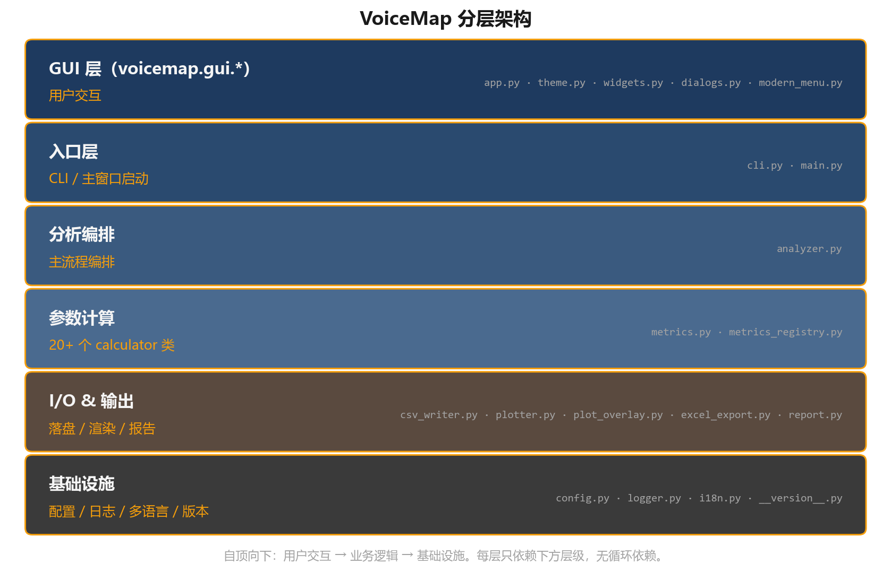

# 嗓音声学品质多维分析图谱 · 设计说明书

**软件名**：嗓音声学品质多维分析图谱（VoiceMap）
**版本**：V1.0.0
**作者**：蔡寰宸 (Huanchen Cai)
**邮箱**：huanchen.se@gmail.com
**版权**：Copyright © 2026 蔡寰宸 · MIT 许可

---

## 1. 概述

本文档为开发说明书，描述 VoiceMap 的整体架构、模块组织、数据流、关键
算法及关键设计决策。配套用户手册见 `用户手册.md`。

---

## 2. 总体架构

### 2.1 分层



自顶向下分 6 层：用户交互层（GUI）→ 业务逻辑层（入口 / 编排 /
计算 / 输出）→ 基础设施层（配置 / 日志 / 多语言）。每层只依赖
下方层级，无循环依赖。

### 2.2 模块依赖图（无循环）

```
config / logger / i18n / __version__   (叶子)
        ↓
metrics_registry              (叶子)
        ↓
metrics → config
plotter → metrics_registry
plot_overlay  (叶子)
excel_export  (叶子)
report        (叶子)
        ↓
analyzer → config / logger / metrics / plotter
csv_writer → analyzer / plotter / logger
        ↓
gui.theme / gui.modern_menu  (叶子)
gui.widgets / gui.dialogs → gui.theme + i18n
gui.app → analyzer / csv_writer / config / logger / plotter / 
          plot_overlay / report / excel_export / i18n / 
          gui.theme / gui.widgets / gui.dialogs / gui.modern_menu
        ↓
cli → analyzer / config / logger / gui.app / report / excel_export
        ↓
main.py    (入口 shim)
```

---

## 3. 项目目录

```
VoiceMap/
├── main.py                          # 入口 shim：把项目根加进 sys.path 后调 voicemap.cli.main
├── 启动.bat                          # Windows 双击启动
├── pyproject.toml                    # 标准 Python 包配置
├── requirements.txt                  # 兼容旧式依赖清单
├── LICENSE                           # MIT 许可 + 上游 KTH FonaDyn 致谢
├── README.md                         # 项目说明
├── VoiceMap.spec                     # PyInstaller 打包规格
├── build_exe.bat                     # 打包脚本
├── installer.iss                     # Inno Setup 安装包脚本
├── audio/test_Voice_EGG.wav          # 测试样本（60 秒立体声）
├── docs/
│   ├── 用户手册.md
│   └── 设计说明书.md
├── tests/validate_params.py          # 验证脚本（参数交叉对照）
├── result/                           # 默认输出目录（不入版本库）
├── dist/                             # 打包产物（不入版本库）
└── voicemap/                         # 主程序包
    ├── __init__.py
    ├── __version__.py                # 版本 / 作者 / 版权单一来源
    ├── config.py                     # VoiceMapConfig dataclass
    ├── logger.py                     # setup_logger / get_logger
    ├── i18n.py                       # 中英 STRINGS dict + tr() + 持久化
    ├── analyzer.py                   # VoiceMapAnalyzer 主类
    ├── csv_writer.py                 # write_vrp() 落盘逻辑
    ├── metrics.py                    # 所有参数 calculator 类
    ├── metrics_registry.py           # MetricSpec 注册表（描述 / 单位 / 范围 / cmap）
    ├── plotter.py                    # VRP 热图渲染
    ├── plot_overlay.py               # 拟合曲线 / 标注叠加
    ├── excel_export.py               # 多 sheet xlsx
    ├── report.py                     # 临床叙述 .md 报告（含 _THRESHOLDS）
    ├── cli.py                        # argparse + dispatch
    └── gui/
        ├── __init__.py
        ├── theme.py                  # 颜色 / 字体 / 参数分组（视觉单一来源）
        ├── modern_menu.py            # ModernMenubar + ModernPopup
        ├── widgets.py                # HoverTooltip + MetricPopup + 焦点可达 Label 工厂 + QueueHandler
        ├── dialogs.py                # SettingsDialog / CompareDialog / ProgressDialog / AboutDialog / LogWindow
        └── app.py                    # VoiceMapApp 主类 + 菜单工厂 + 各面板
```

---

## 4. 数据流

### 4.1 单文件分析（GUI）

```
用户拖入 wav
   ↓
gui.app._on_drop → _on_audio_dropped(path)
   ↓
_tracks_add(path) → 创建 TrackEntry，读 wav 头（sr/duration/channels）
   ↓
_tracks_set_active(idx)  ← 第一个文件自动 active
   ↓
_start_analysis(path)  ← 点 "开始分析" 触发
   ↓
worker thread:
  analyzer.analyze_and_output_vrp(audio, ...)
    1. load_audio              soundfile 读 wav，分声 / EGG 通道
    2. preprocess              EGG 带通 + 高通 + 压缩扩展（compander）
    3. detect_cycles           Phase Portrait + numba JIT，输出 cycle 起止
    4. filter_cycles           clarity 阈值过滤
    5. calculate_all_metrics   每个 calculator 跑过 cycle_triggers
        ├── SPL / Clarity / CPP / SpecBal / Crest / Entropy
        ├── Qcontact / Icontact / dEGGmax / HRFegg / OQ / SPQ / CIQ
        ├── Jitter (3 种) / Shimmer (5 种) / HNR / NHR
        ├── Vibrato rate / extent / jitter
        ├── Formant F1/F2/F3 + 带宽 + dispersion
        ├── EGG K-means cluster (k 簇) + cPhon K-means (k 簇)
        └── 频谱形态：RMS / F0_Hz / 谱矩 / Alpha Ratio / Hammarberg / GNE / CPPS / PPE / ZCR
    6. partial_cb              第一组指标完成 → 主线程渲染早期热图
    7. csv_writer.write_vrp    构 DataFrame → range filter → groupby agg
                               → 空簇救援 → cluster 列聚合 → CSV 写盘
    8. plotter.plot_vrp_*      可选 PNG 导出
   ↓
回主线程（msg_q → _drain_queue 'done'）
   ↓
更新 active TrackEntry.df / state="analyzed"
   ↓
_render_metric / _update_inspector / _update_statusbar
```

### 4.2 鼠标悬浮探测

```
matplotlib motion_notify_event
   ↓
_on_canvas_motion(event)
   ↓
event.xdata=MIDI, event.ydata=SPL → round to int
   ↓
_last_df 查 cell  → 参数值
_THRESHOLDS 查严重度档位
   ↓
_update_inspector_value() → .configure() 4 个 Label（不重建 widget）
```

### 4.3 多文件切换

```
用户点录音轨第 N 行
   ↓
_tracks_set_active(N)
   ↓
TrackEntry[N].state == "analyzed"?
  yes → 把 TrackEntry.df 同步到 self._last_df / audio_path / 等
        → _render_metric / _update_inspector / _update_statusbar
  no  → _start_analysis(TrackEntry.path)
```

---

## 5. 关键模块

### 5.1 voicemap.config

`@dataclass class VoiceMapConfig`：所有可调参数集中。`DEFAULT_CONFIG`
作为单例。GUI 设置面板修改的是这份；analyzer 启动时传入。

主要字段：sample_rate, clarity_threshold, n_min/max_midi, n_min/max_spl,
spl_correction_db, output_dir, audio_file。

### 5.2 voicemap.analyzer

`class VoiceMapAnalyzer`：分析编排。约 19 个方法、660 行；
CSV 输出逻辑独立在 `csv_writer.py`，渲染独立在 `plotter.py`。

主要方法：
- `analyze_and_output_vrp(audio_path, return_df, plot_mode, progress_cb,
   partial_cb)` — 顶层入口
- `load_audio` / `preprocess_egg` / `phase_portrait_cycle_detection` /
  `filter_cycles` / `calculate_all_metrics`
- `train_cluster_centroids(wavs)` — 多 wav 联合 K-means
- `load_centroids(path)` / `save_centroids(path)` — cEGG.csv I/O
- `_aggregate_cluster_labels` — maxCluster + share% 列

### 5.3 voicemap.metrics

20+ 个 calculator 类，每个都遵循 `__init__(config) + calculate(signal, ...)`
约定。按所测物理量分组（不按实现先后）：

| 组 | 类 | 输出列 |
|----|-----|--------|
| 基础 | SPLCalculator / ClarityCalculator | spl / clarity |
| 声压 / 音高 | RMSCalculator / F0HzCalculator | rms / f0_hz |
| 倒谱 / 周期性 | CPPCalculator / CPPSCalculator / PPECalculator / ZCRCalculator | cpp / cpps / ppe / zcr |
| 频谱矩 | SpectralMomentsCalculator | spec_centroid / spec_bandwidth / spec_rolloff85 / spec_flatness / spec_slope / spec_skewness / spec_kurtosis |
| 频谱比例 | IntegrativeMetricsCalculator | alpha_ratio / hammarberg / gne |
| 谱平衡 / 动态 | SpecBalCalculator / CrestCalculator | specbal / crest |
| EGG 接触 | QcontactCalculator / EntropyCalculator / HRFCalculator | qcontact / icontact / entropy / hrf / deggmax |
| EGG 开商 | OpenQuotientCalculator | oq / spq / ciq |
| 扰动 | PerturbationCalculator | jitter (3 种) / shimmer (5 种) |
| 噪声 | HNRCalculator / NHRCalculator | hnr / nhr |
| 唱歌 | VibratoCalculator / VibratoJitterCalculator / FormantCalculator / FormantExtrasCalculator / HarmonicDiffCalculator | vibrato_rate/extent/jitter / f1/f2/f3 / b1/b2/b3 / formant_dispersion / sing_formant / spr / h1h2 / h1h3 |
| 聚类 | ClusterCalculator / PhonClusterCalculator | cluster 1..k / phon 1..k / maxCluster / maxCPhon |

#### 关键算法决策

- **EGG 周期检测**：相位肖像（Dolansky 算法）+ numba JIT，~2.4× 速度
- **Formant 带宽**：LPC 频谱 −3 dB FWHM，邻峰约束防止跨过去，800 Hz 硬上限
- **K-means 空簇救援**：3 层（UI / Calculator 内 / Aggregator 后）确保
  每个 1..k 标签都至少出现一次
- **Vibrato**：F0 时序 → bandpass 3–10 Hz → 过零 + autocorr

完整 calculator 实现见 `voicemap/metrics.py`，每个类有 docstring。

### 5.4 voicemap.metrics_registry

`@dataclass class MetricSpec`：参数元数据登记。每个有效输出列必须
有 spec：`key, category, label, vmin, vmax, unit, cmap, description`。
`get(key) -> Optional[MetricSpec]`。

GUI 右侧详情栏的 "描述 / 单位" 读这个；plotter 的 vmin / vmax 也读这个。
新加参数改一处即可。

### 5.5 voicemap.csv_writer

`write_vrp(analyzer, metrics, return_df, plot_mode, export_plots, write_disk)`
—— 落盘逻辑。流程：

1. 对齐所有 calculator 输出到 `base_n`（cycle 数）
2. 构 DataFrame（每行一个 cycle）
3. range filter（MIDI ∈ [30, 96]，SPL ∈ [40, 120]）
4. groupby (MIDI, dB) agg（Clarity 取 max，其他取 mean，Total 取 sum）
5. 空簇救援
6. maxCluster + Cluster 1..k 列聚合（k 由设置里的「聚类簇数」决定，
   同样规则用于 cPhon）
7. 标准列序排列
8. 写 CSV（分号分隔）+ plot 分发

### 5.6 voicemap.plotter

`draw_vrp_on_ax(ax, fig, df, col)`：单个参数的 (MIDI × SPL) 热图渲染。
`plot_vrp_dataframe(df, ts_base, plot_dir)`：批量 PNG 导出。
`plot_vrp_combined(df, ts_base, plot_dir)`：单图合并所有参数的总览。

颜色映射统一走感知均匀（perceptually uniform）+ 色盲安全调色板：
viridis（顺序型）/ coolwarm（双向型）/ mako（密度型）/ Okabe-Ito 5 色
（类别型）。具体由每个参数的 `MetricSpec.cmap` 决定。

### 5.7 voicemap.report

临床叙述报告。核心是 `_THRESHOLDS: Dict[str, List[Tuple[lo, hi, label, severity]]]`
查询表：每个参数一组档位，severity ∈ {good, normal, watch, abnormal}。

`generate_report(grouped_df, out_path, audio_name)` —— 6 大类：总览 /
嗓音质量 / EGG / 唱歌 / 频谱 / 自动观察。带跨参数启发式
（如 Jitter 高 + Shimmer 高 → "嗓音粗糙"）。

GUI 右侧详情栏的临床范围卡也读 `_THRESHOLDS`。

### 5.8 voicemap.gui.app

`class VoiceMapApp(_TkBase)`：主窗口。约 2700 行；
自定义控件、对话框、工具栏拆到 `gui/widgets.py`、`gui/dialogs.py`、
`gui/modern_menu.py`、`gui/theme.py`。

主要职责：
- `_build_*` 系列：菜单栏 / 录音轨 / 参数轨 / 右侧详情栏 / 状态栏
- 5 个 popup factory：`_popup_file/edit/metric/view/help`（菜单点开时调）
- 多文件状态：`_tracks: list[TrackEntry]` + `_active_track: int`
- 分析线程：`_start_analysis` 走 worker thread，msg queue 送回主线程
- i18n 订阅：`_on_language_changed` 重建菜单 + 更新 persistent widgets

### 5.9 voicemap.gui.modern_menu

`ModernMenubar`：horizontal Frame of label-buttons，点击弹下拉。
`ModernPopup`：borderless Toplevel + 自定义 row layout，支持
command / separator / cascade / radiobutton 四种条目，Win32
`SetWindowRgn` 给 popup 加圆角。

### 5.10 voicemap.gui.theme

颜色 + 字体 + 参数分组的视觉单一来源。深灰底 + amber 强调色：

```
BG_APP        #0a0a0a     窗口底色
BG_PANEL      #1a1a1a     面板 / 菜单条
BG_ELEVATED   #2a2a2a     悬浮 / 选中行
BORDER        #3a3a3a     1 px 分隔线
TEXT          #f5f5f5     主文字
TEXT_SEC      #a3a3a3     副文字
ACCENT        #f59e0b     amber，唯一品牌色
SUCCESS / WARN / ERROR    语义色（成功 / 警告 / 错误）
```

字体分级：CAPTION 9 pt / SMALL 10 pt / UI 11 pt / SUB 12 pt /
DROP 13 pt / TITLE 14 pt / INSPECTOR_NAME 19 pt / DISPLAY 22 pt
+ MONO / MONO_B 等宽。

### 5.11 voicemap.i18n

```python
STRINGS = {
    "zh": {"menu.file": "文件", ...},
    "en": {"menu.file": "File", ...},
}
def tr(key, **kw): ...
def set_language(lang): ...
def subscribe(callback): ...
```

160+ 键，中文 / 英文严格对称。持久化到 `~/.voicemap/config.json`。

---

## 6. 关键设计决策

### 6.1 为什么用 EGG 信号做周期切分

电声门图（EGG）通过颈部表面电极直接采集声带接触面积变化，时域波形
在每次声门关闭瞬间出现陡峭的下降沿，是世界公认的"逐周期声学分析"
最干净的同步信号。

相比之下，**纯麦克风信号**做周期切分（如自相关 / pYIN / SEDREAMS
等方法）需要先识别基频再反推周期边界，受房间反射、辅音段、共振峰
干扰的影响大，**周期边界的样本级精度比 EGG 差一个量级**。

逐周期切分的精度直接决定：
- Jitter / Shimmer（周期间扰动）的准确性
- EGG 接触商 Qcontact 等所有"形状特征"参数的可靠性
- K-means 聚类输入特征（每周期 n 阶谐波幅度 + 相位）的稳定性

因此本软件要求双声道 WAV（通道 1 = 麦克风，通道 2 = EGG）作为主输入
格式。纯麦克风模式作为后续版本的扩展规划见 `docs/_dev/ROADMAP.md`。

### 6.2 为什么使用 (MIDI 音高 × SPL 声压级) 二维网格

嗓音质量随音高和声压剧烈变化 —— 同一个发声者，低音轻声和高音强声的
CPP / Jitter / HNR 可能相差一个量级。把所有周期混在一起取均值会把这种
**条件依赖**信息全部抹平，得到一个临床上几乎无意义的"平均值"。

二维网格保留了「在哪个音高、什么声压时嗓音质量如何」的完整画面：
- 临床上立刻能看出"歌手只在 G4 以上有破音"还是"全音域噪谐比都偏低"
- 训练上能看到"中低音 OQ 正常，高音过低（挤压）"这样的细节
- 比较两段录音时，三联图（A | B | A−B）直接呈现差异分布

MIDI（半音整数）+ SPL（dB 整数）的离散网格便于聚合 + 颜色编码 +
跨录音叠加比较，是嗓音研究界（KTH / Praat 社区）的事实标准坐标系。

### 6.3 为什么显示严重度色（绿 / 灰 / 橙 / 红）

软件目标用户里相当比例是非声学专家（声乐老师、临床医生、歌手本人）。
仅给出原始数值（"CPP = 13.4 dB"）需要查阅文献阈值才能解读，门槛过高。

软件读取 `_THRESHOLDS` 里基于已发表文献（MDVP / KayPENTAX / Hillenbrand
1996 / Hammarberg 1980 / 临床嗓音学共识）的分档阈值，把数值映射到 4 档
严重度色：
- **绿色 ✓** 良好范围（健康嗓音上限或专业表现区间）
- **灰色 ·** 正常范围（多数健康嗓音落点）
- **橙色 !** 需关注（轻度异常 / 临界）
- **红色 ✗** 异常（病理 / 显著偏离正常）

用户即使不懂 CPP 是什么，也能从颜色直接判断"这个嗓音指标当前在
什么档位"。同时严重度色也参与多参数关联推断（如 Jitter ✗ + Shimmer ✗
→ 自动报告标"嗓音粗糙"）。

### 6.4 为什么 EGG 类参数沿用 KTH FonaDyn 公式而不参考 Praat

**Praat 不计算 EGG 类参数。** Praat 是纯麦克风分析工具，只处理声学
（voice）信号。EGG 接触商 Qcontact、Icontact、HRFegg、声门开商 OQ /
SPQ / CIQ 等参数都需要电声门图通道，Praat 没有这一套实现。

世界上对 EGG 类参数有完整算法的开源参考实现是 KTH 皇家理工学院的
**FonaDyn**（SuperCollider 项目，作者 Sten Ternström 等）。本软件
**用 Python 独立实现了 FonaDyn 的 EGG 算法集，并做了以下改进**：

- 周期级 K-means 聚类后加 3 层空簇救援（FonaDyn 无此保证）
- Formant 带宽用 LPC 谱 FWHM 替代 root-finding，速度提升 10×
  且数值稳定
- 频谱形态参数（谱矩 / Alpha Ratio / Hammarberg / GNE）参考
  Eyben et al. 2016 的 eGeMAPS 实现
- 加入了 FonaDyn 没有的"逐参数严重度档位"和"自动叙述报告"

声学（voice）类参数中，Jitter / Shimmer / HNR 的公式与 MDVP /
KayPENTAX 行业标准保持一致；CPP 跟 Hillenbrand 1996 论文一致；
Clarity 采用 McLeod-Wyvill NSDF。这些都是公开发表的、可重现的算法。

---

## 7. 性能

| 操作 | 耗时（60 秒立体声 wav，i7-12700） |
|------|----------------------------------|
| 音频加载 + 预处理 | ~0.3 s |
| 周期检测 (numba) | ~0.5 s |
| 全参数计算 | ~10 s |
| CSV 写盘 + 图片分发 | ~1.5 s |
| **总耗时** | **~12.5 s**（约 5 倍实时） |
| GUI 启动到可交互 | ~1.5 s |
| 第一次 numba 编译 | +1–2 s（仅首次） |

内存峰值约 800 MB（matplotlib + 全部周期特征）。

---

## 8. 质量保证

软件内附 `tests/validate_params.py` 验证脚本，覆盖四个维度：

1. **跨工具交叉对照**：以 Praat（开源嗓音分析参考实现）为基准，
   核对 voice 类参数（F0、Jitter、Shimmer、HNR、CPP、Formant 等）
   在同一段测试录音上的数值差异
2. **范围检查**：每个参数的输出值必须落在物理合理区间（如 OQ ∈
   [0, 1]、SPL ∈ [0, 120] 等）
3. **结构检查**：CSV 字段名 / 列序 / 数据类型 / 必填列覆盖率
4. **内部一致性**：同一录音多次分析得到的结果数值稳定
   （以及交叉算法的等价性，例如 NHR ≈ 1 / HNR）

每次结构性变动或算法改动均跑全套验证，确保软件输出与公开文献结果
对得上。当前基准：48 项通过、4 项标记差异（已知方法学差异，
有文献佐证），0 项失败。

---

## 9. 部署 / 打包

打包流程：

```
PyInstaller (build_exe.bat)
   ↓
dist/VoiceMap/VoiceMap.exe + _internal/ 全部依赖
   ↓
Inno Setup (installer.iss)
   ↓
dist/VoiceMap_v1.0.0_setup.exe   ← 终端用户的安装包
```

PyInstaller 命令（写在 `VoiceMap.spec` 里）使用 one-folder 模式：
主程序 + numpy / scipy / pandas / matplotlib / soundfile / numba /
scikit-learn / openpyxl / tkinterdnd2 等依赖一起打到 `dist/VoiceMap/`，
约 200 MB 解压后。

Inno Setup 把上述目录压缩为 `VoiceMap_v1.0.0_setup.exe`（约 90 MB），
安装时支持桌面 / 开始菜单快捷方式、可选语言（英文 / 简体中文）、
卸载注册到 Windows Apps 列表。

`pyproject.toml` 的 `[project.scripts] voicemap = "voicemap.cli:main"`
保留以便 `pip install -e .` 开发模式使用。

---

## 10. 参考与致谢

本软件的 EGG 类参数算法（Qcontact / Icontact / HRFegg / Entropy /
EGG 周期聚类）参考自 KTH 皇家理工学院的 FonaDyn (SuperCollider) 项目
（作者 Sten Ternström 等），Python 实现完全独立编写并做了若干改进
（详见 § 6.4）。

  https://github.com/StenTernstrom/FonaDyn

主要参考文献：

- Hillenbrand & Houde 1996 — CPP 公式
- MDVP / KayPENTAX — Jitter / Shimmer / HNR 阈值
- McLeod & Wyvill 2005 — NSDF clarity
- Dolansky 1955 — 相位肖像周期检测
- Hammarberg 1980 — Hammarberg Index 临床嗓音研究
- Eyben et al. 2016 — eGeMAPS 频谱形态特征
- Sundberg — 歌者共振峰 / SPR
